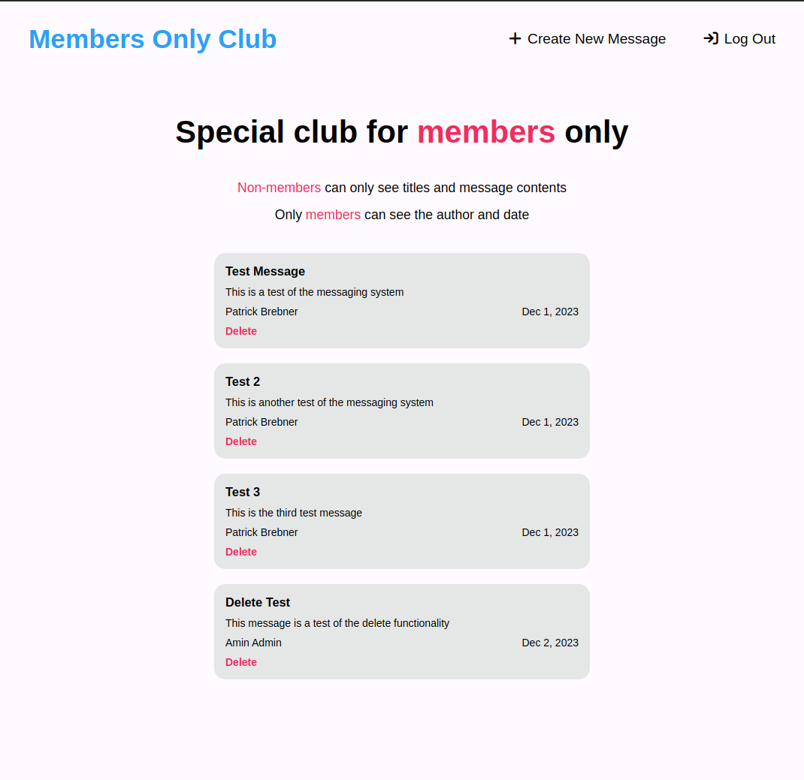

# Members only Club

## About

Message board website created as part of The ODIN Project curriculum that limits what you can see depending if you are a member of the club. Users can sign-up to become a member and certain members have admin status that allows them to moderate and delete messages.

## Features

-   Create and Read public messages
-   User authorization and permission management
-   Securing passwords with bcryptjs
-   Admin users able to moderate and Delete messages
-   Schema validation using Mongoose

## Technologies Used

-   NodeJS
-   ExpressJS
-   MongoDB
-   Mongoose
-   bcryptjs

## TODO

-   Add additional checks in controllers to confirm user status before displaying page
